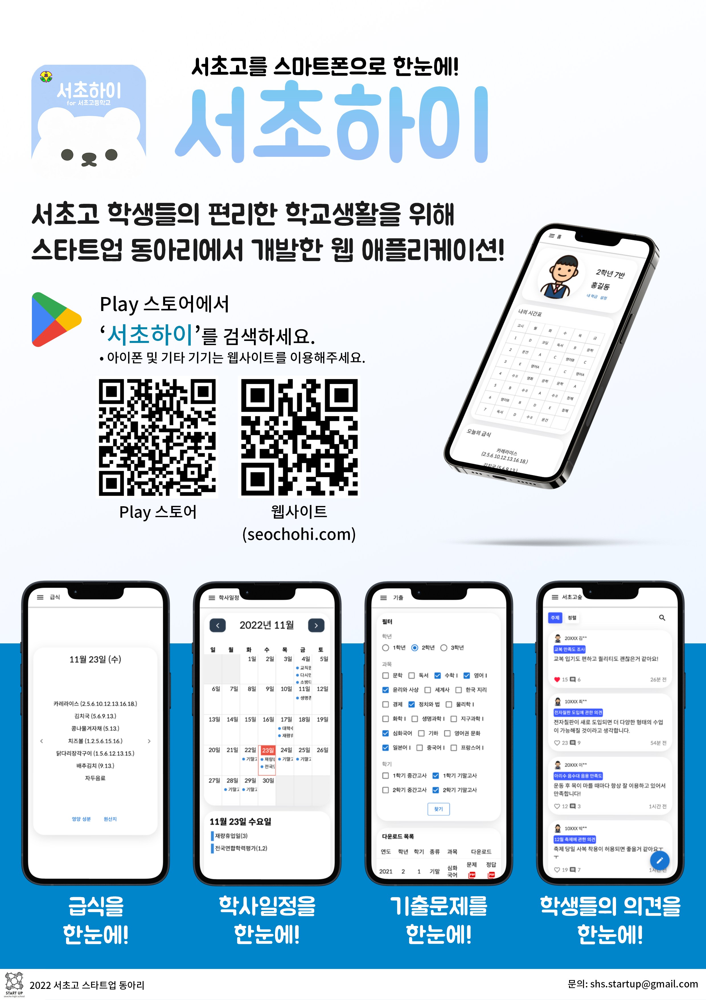
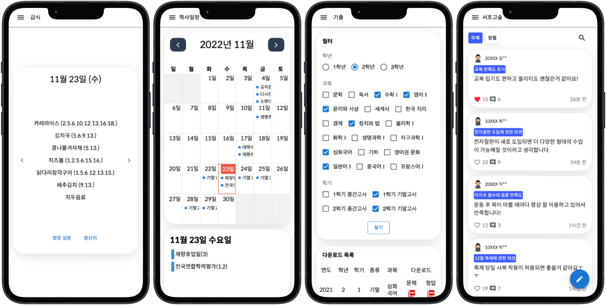

### 2022 서초고 스타트업 동아리 웹앱 프로젝트

# 서초하이 SeochoHi

---

```
본 프로젝트는 1월 18일자로 종료되었습니다.
```

---

~~[웹사이트](https://seochohi.com)~~

~~[플레이스토어](https://play.google.com/store/apps/details?id=com.startup.seochohi)~~

### [홍보 포스터]

> 

### [주요 기능 소개]

> 

### [스크린샷]

> - #### [라이트 모드](./assets/screenshots/light#라이트-모드light-mode-스크린샷)

> - #### [다크 모드](./assets/screenshots/dark#다크-모드dark-mode-스크린샷)

---

### [프론트엔드]

> - ## HTML/CSS/Javascript
> - ## [React.js](https://ko.reactjs.org)
> - ## [Material UI](https://mui.com)

### [백엔드]

> - ## [Node.js](https://nodejs.org/en)
> - ## [Express](https://expressjs.com/ko)
> - ## MySQL

### [모바일]

> - ## Kotlin (Android Studio)

### [호스팅]

> - ## 도메인: [가비아](https://gabia.com)
> - ## 서버: [카페24](https://cafe24.com) - Windows Server ([IIS](https://www.iis.net))
> - ## 인증서: [Let's Encrypt](https://letsencrypt.org/ko)

### [사용한 프로그램]

> - [Visual Studio Code](https://code.visualstudio.com)
> - [Github Desktop](https://desktop.github.com)
> - [Android Studio](https://developer.android.com/studio)
> - [Postman](https://www.postman.com)
> - [MySQL Workbench](https://www.mysql.com/products/workbench)
> - [Figma](https://www.figma.com)
> - [Adobe Photoshop](https://www.adobe.com/kr/products/photoshop.html)

---

프로젝트 출시 일정 변경 및 기타 이유로 인해 개발이 완료되지 않거나 중단된 요소들:

- PC 버전 레이아웃
- 메모장 /myclass/quicknotes
- 수행평가 /myclass/assessments
- 학사일정 필터링
- 선생님 /wiki/teachers
- 새로운 환경에서 로그인 시 학생증 인증
- 비밀번호 재설정

---

by 2022 서초고 스타트업 동아리
