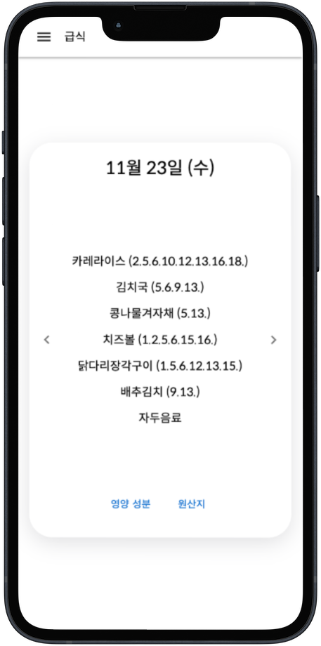
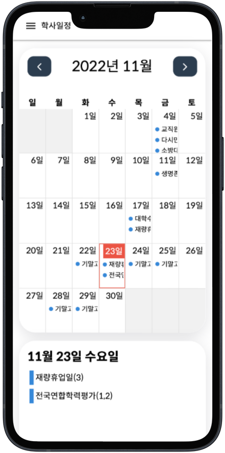
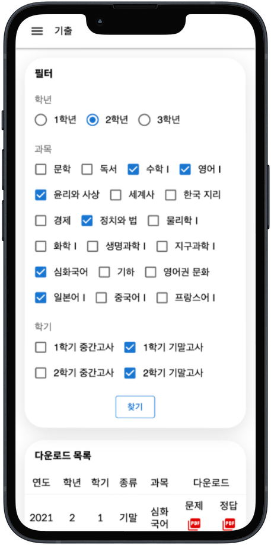
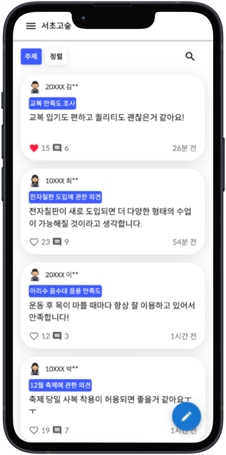

##### [플레이스토어 앱 출시]

# 서초하이! for 서초고등학교

#### 서초고등학교 학생들의 편리한 학교생활을 위한 웹 애플리케이션

---

- 그래픽 이미지


---

- 스크린샷

<p float="left">




</p>

---

- 앱 정보

```
---------------------------------------------------------------------------------
서초고등학교 학생들의 편리한 학교생활을 위해 서초고 스타트업 동아리에서 제작한 웹 애플리케이션, 서초하이!

주요 기능 소개:
[서초위키]
- 오늘의 학교 급식을 한눈에!
- 더욱 세세한 학교 일정을 한눈에!
- 우리학교 기출문제를 한눈에!

[서초고숲]
- 학생들의 의견을 한눈에!

[서초타임]
- 각종 학교 이벤트를 바로 확인하고 참여할 수 있는 가장 빠른 방법!

[나의 학급]
- 내 학급 시간표를 한눈에!
---------------------------------------------------------------------------------
2022 서초고 스타트업 동아리
부장: 허윤호
문의: shs.startup@gmail.com
```
